# containercraft.opnsense

A general-purpose Ansible collection that configures an [OPNsense](https://opnsense.org/)
edge router entirely through its REST API. It builds VLAN interfaces, Unbound
DNS, Kea DHCP, a zone-to-zone firewall policy, and CARP high availability, and it
sequences those changes through a monotonic migration model so a live network can
be re-architected without an outage.

The collection ships reusable roles only. A companion *deploy* layer (an
inventory, a values file, and an executable entrypoint) turns those roles into a
running deployment. The two layers are kept strictly separate so the collection
stays publishable and reusable while each site's identity lives in its own deploy
tree.

---

## §0 — How to read this document

This document serves every reader from a first-time hobbyist to a collection
maintainer. It is ordered by **how often a section is revisited**, not by
difficulty: the material an operator returns to daily sits near the top, and the
deep, read-once architecture and contributor material sits lower.

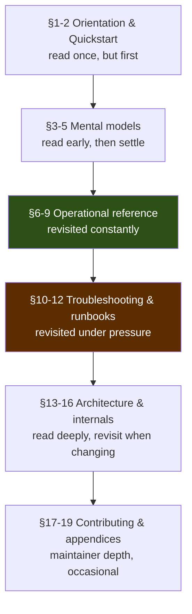

Each section opens at the lowest level of background it can and adds depth toward
the end. A reader can stop at the first heading that answers the question at hand.
Three callout markers flag content by audience:

> ⚠️ **Blast radius** — an operation that changes a live network; read before running.

> 💡 **Shortcut** — a faster or safer path for routine work.

> 🔬 **Deeper** — internals and rationale for maintainers and SMEs; skippable for operation.

### Where to start, by role

| Reader | Read first | Then | Reference |
|---|---|---|---|
| Hobbyist / student | §1, §2 | §3, §4 | §6, §7 |
| Intern / junior operator | §1–§4 | §7, §10, §11 | §6, §9 |
| Senior operator | §3–§5 | §8, §9, §11, §12 | §10, §19 |
| Staff / principal engineer | §5, §13, §14 | §15, §16 | §9, §17 |
| Maintainer / SME | §14–§17 | §18, §19 | all |

---

## §1 — What this is, and what it is not

### What it is

`containercraft.opnsense` automates an OPNsense firewall the way a person would
automate a cloud provider: by calling an API. Every change — a VLAN, a firewall
rule, a DHCP scope — is an HTTP request to the firewall's REST endpoint. There is
no configuration file pushed to the box and, with one deliberate exception, no SSH
session. The firewall is treated as a service with an API, and the roles are
clients of that service.

The collection encodes three things that raw API calls do not:

- **A data model.** The network's shape — its zones, subnets, trunk ports, and
  inter-zone policy — is declared once as data. Roles render that data into API
  calls. No role contains a literal subnet, VLAN tag, or IP address.
- **A migration model.** Real edge routers are replaced while in service. A
  monotonic phase variable (`coexist → migrating → hardening → converged`) gates
  which services run where, so the existing LAN keeps working until clients have
  moved.
- **An idempotent, recoverable apply.** Re-running converges to the same state.
  Firewall changes are wrapped in a server-side savepoint that auto-reverts if
  connectivity is lost, so a bad rule cannot lock the operator out.

### What it is not

- It is **not** a replacement for OPNsense's own configuration. It manages the
  objects it creates (tagged with a managed-by marker) and leaves everything else
  alone.
- It is **not** a one-shot installer. It is designed to be run repeatedly, a
  little at a time, advancing through phases.
- It does **not** implement masquerade/outbound NAT. OPNsense's automatic
  outbound NAT already masquerades internal zones to the WAN address; the
  collection relies on that default rather than duplicating it (see §9.6 and §16).
- It is **not** tied to any one site. The collection is general-purpose; the
  example network used throughout this document belongs to a deploy layer, not to
  the collection.

---

## §2 — Quickstart

This section takes a reader from nothing to a safe, read-only dry run against a
firewall. It assumes the firewall is reachable and an operator account exists on
it.

### Prerequisites

- `ansible-core >= 2.14` and Python `>= 3.12` on the controller.
- Network reachability to the firewall's HTTPS API.
- An OPNsense user that can hold an API key. A dedicated service user is
  recommended over a human login.

### Five commands

```bash
# 1. Install this collection and its upstream dependency into a playbook-adjacent
#    collections/ directory (the deploy layer does this automatically; shown here
#    for a standalone install).
ansible-galaxy collection install -r requirements.yml -p collections

# 2. Provide credentials. The deploy layer reads them from the environment.
export OPNSENSE_FIREWALL=10.0.0.1
export OPNSENSE_API_KEY=...        # see §12 to mint these
export OPNSENSE_API_SECRET=...

# 3. Confirm the API answers and the key authenticates (read-only).
ansible-playbook site.yml --tags connect

# 4. Dry-run the whole configuration. Nothing is written; the would-change set
#    and per-object diffs are printed.
ansible-playbook site.yml --check --diff

# 5. Apply one concern at a time once the dry run looks correct.
ansible-playbook site.yml --tags dns
```

> 💡 In a configured deploy tree, the entrypoint replaces `ansible-playbook
> site.yml` with a single executable: `./stargate.yml --tags connect`. See §11.

> ⚠️ Command 5 writes to the firewall. Until an operator has read §4 (phases) and
> §11 (the iterative runbook), it is safest to stay on `--check` and `--tags
> connect`.

### What success looks like

`--tags connect` ends with `OPNsense API reachable at <address>` and
`failed=0`. If it does not, jump to §10.1.

---

## §3 — Mental model 1: an API-driven edge router

The single most important idea in this collection: **the firewall is configured
by calling its REST API, not by editing it.** Internalizing this explains the
structure of every role.

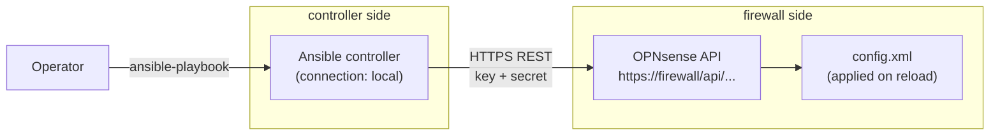

The controller runs the modules locally (`connection: local`) and each module
issues HTTPS requests to the firewall. The firewall validates, stores, and — on a
`reload` call — applies the change. This has several consequences that shape the
whole collection:

- **Authentication is an API key/secret pair**, sent on every request. There is
  no session, no SSH key, no password to the box for normal operation.
- **A change is two steps: configure, then reload.** Roles create or update many
  objects with `reload: false`, then issue a single `reload` per subsystem. This
  is faster and avoids partial-apply churn.
- **Most operations are check-mode safe.** Because they are API reads and writes,
  Ansible can predict and diff them without touching the box.

### The one exception: bootstrap

A firewall configured through its API needs an API key before it can be
configured. Minting that first key writes `config.xml`, which is root-gated and
cannot be done through the API. Exactly one role — `opn_bootstrap_apikey` — breaks
the API-only rule: it connects over SSH, escalates to root, mints a key, and
writes it where the API-driven roles can read it. After bootstrap, everything
returns to the API model. This chicken-and-egg resolution is detailed in §12.

> 🔬 **Deeper.** The collection consumes the `oxlorg.opnsense` collection for the
> actual API module implementations. `containercraft.opnsense` orchestrates;
> `oxlorg.opnsense` speaks the protocol. The boundary between them is described in
> §16, and it is the reason the roles can stay declarative.

---

## §4 — Mental model 2: the migration phases

An edge router is rarely built on a green field. It usually replaces an existing
router while the network stays up. The collection models this as a **monotonic
phase**, a single variable that advances in one direction and gates what each role
is allowed to do.

```mermaid
stateDiagram-v2
    [*] --> coexist
    coexist --> migrating
    migrating --> hardening
    hardening --> converged
    converged --> [*]

    coexist: coexist — new edge stands up beside the live LAN
    migrating: migrating — clients move; zone DHCP/DNS active
    hardening: hardening — posture tightened; HA prepared
    converged: converged — legacy edge services withdrawn
```

The phase is not a feature flag set; it is a promise about what the **existing
network** experiences at each step. The guiding rule is *never strand a client*.

| Phase | Legacy segment edge DHCP/DNS | New zones | Zone DHCP | HA | Decommission |
|---|---|---|---|---|---|
| `coexist` | untouched | created, no clients | off | off | off |
| `migrating` | still served | active | on | off | off |
| `hardening` | still served (fallback) | active | on | prepared | off |
| `converged` | withdrawn | active | on | active | on |

A phase resolves to a small set of capability booleans (defined in
`shared/netspec/phases.yml`), and roles gate their riskier tasks on those
booleans rather than checking the phase string directly:

```yaml
# shared/netspec/phases.yml (excerpt)
phase_defaults:
  coexist:
    zone_dhcp: false
    edge_serves_legacy_lan: true
    decommission_legacy: false
  converged:
    zone_dhcp: true
    edge_serves_legacy_lan: false
    decommission_legacy: true
```

> ⚠️ **Blast radius.** The phase is monotonic by intent. Advancing to `converged`
> instructs `opn_edge_decommission` to remove edge DHCP/DNS from the legacy
> segment. That role is additionally gated on measured evidence (zero active
> leases) so the withdrawal cannot strand a device that has not yet moved. See
> §9.8.

> 💡 The default phase is `coexist` — the safe, non-disruptive posture. A fresh
> run with no configuration touches no existing client traffic.

---

## §5 — Mental model 3: the collection / deploy boundary

The collection contains **reusable roles and nothing site-specific**. A separate
**deploy layer** supplies the site's identity — its inventory, its credentials,
its network data, and an executable entrypoint. Understanding this split explains
why the roles have no subnets in them and where an operator's own values belong.

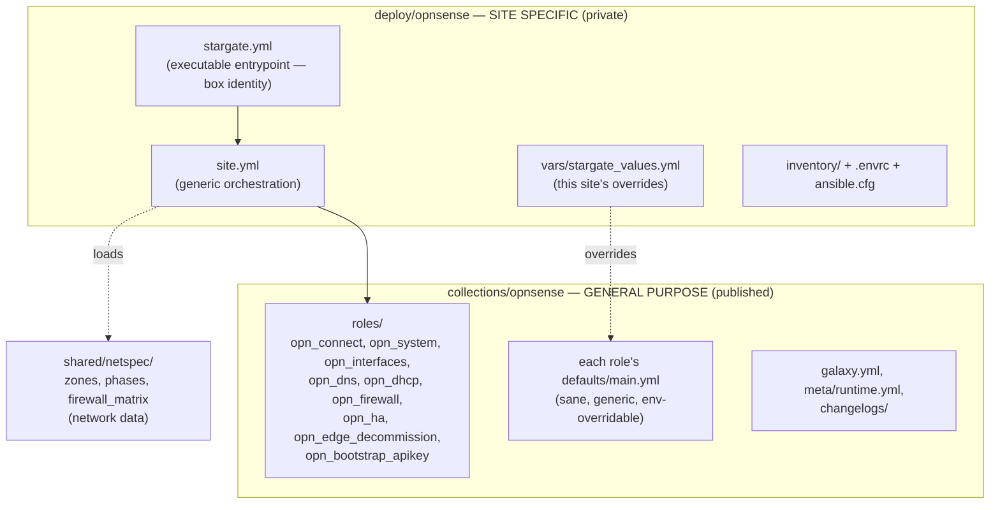

| Layer | Lives in | Contains | Site identity? |
|---|---|---|---|
| **Collection** | `collections/opnsense/` | reusable roles, defaults, galaxy metadata | none |
| **Deploy** | `deploy/opnsense/` | entrypoint, inventory, values, env | confined here |
| **Network data** | `shared/netspec/` | zones, phases, firewall matrix | site topology as data |

The boundary is enforced by a single discipline: **every variable a role needs has
a default inside that role.** A consumer can install the collection from a galaxy
server and run its roles with sane defaults, overriding through the environment or
playbook variables. The example deployment in this repository is one such
consumer; it is not part of the published collection.

> 🔬 **Deeper.** This split follows two prior-art patterns. The collection mirrors
> a published, role-only Ansible Galaxy collection: roles with real
> `defaults/main.yml`, a `galaxy.yml`, `meta/runtime.yml`, and a changelog, and no
> playbooks. The deploy layer mirrors an orchestration repository: executable,
> shebang-driven playbooks that consume the collection and carry the site's
> identity. §14 expands on why the boundary is drawn exactly here.

---

## §6 — Command reference

The commands below assume a configured deploy tree. In a deploy tree the
executable entrypoint (`./stargate.yml`) is equivalent to `ansible-playbook
site.yml` with the site's values pre-selected; both forms are shown where they
differ.

### Everyday commands

| Goal | Command |
|---|---|
| Confirm API + credentials (read-only) | `./stargate.yml --tags connect` |
| Dry-run everything with diffs | `./stargate.yml --check --diff` |
| Apply one concern | `./stargate.yml --tags <tag>` |
| Apply everything | `./stargate.yml` |
| List the tasks a run would execute | `./stargate.yml --list-tasks` |
| Syntax check only | `./stargate.yml --syntax-check` |

### Tags

Each role contributes one or more tags so a run can be scoped to a single
concern. Tags compose; `--tags dns,dhcp` runs both.

| Tag | Role | Effect |
|---|---|---|
| `connect` | opn_connect | read-only API reachability probe |
| `system` | opn_system | tunables and (gated) identity/WAN |
| `interfaces`, `vlans` | opn_interfaces | trunk VLANs, blackhole VLAN, assignment |
| `dns`, `unbound` | opn_dns | Unbound resolver and forwarding |
| `dhcp`, `kea` | opn_dhcp | Kea DHCP per zone |
| `firewall`, `nat` | opn_firewall | aliases and zone rules |
| `ha` | opn_ha | CARP VIPs and config sync (gated) |
| `decommission` | opn_edge_decommission | legacy-segment withdrawal (gated) |

### Bootstrap (separate playbook)

```bash
# Mint an API key over SSH as root, write it to the deployment's .env.
ansible-playbook bootstrap.yml \
  -i inventory/bootstrap.yml \
  -e ansible_user=<wheel-user> \
  -e opn_bootstrap_apikey_user=<api-key-user> \
  --ask-pass --ask-become-pass

# Rotate an existing key (mints new, deletes prior keys for the user).
ansible-playbook bootstrap.yml \
  -i inventory/bootstrap.yml \
  -e ansible_user=<wheel-user> \
  -e opn_bootstrap_apikey_user=<api-key-user> \
  -e opn_bootstrap_apikey_force=true \
  --ask-pass --ask-become-pass
```

> 💡 `--check` and `--tags connect` never write to the firewall and are safe to
> run at any time. They are the two commands an operator runs most.

---

## §7 — Configuration reference

Configuration flows from three sources, lowest precedence first: role defaults
(generic), then the environment and the deployment's values file (site-specific),
then command-line `-e` overrides (one-off). Secrets always come from the
environment, never from a committed file.

### Connection (consumed by every role)

| Variable | Environment | Default | Purpose |
|---|---|---|---|
| `opnsense_firewall_address` | `OPNSENSE_FIREWALL` | empty | API host/IP |
| `opnsense_api_key` | `OPNSENSE_API_KEY` | empty | API key |
| `opnsense_api_secret` | `OPNSENSE_API_SECRET` | empty | API secret |
| `opnsense_api_port` | `OPNSENSE_API_PORT` | `443` | API port |
| `opnsense_ssl_verify` | `OPNSENSE_SSL_VERIFY` | `false` | validate TLS cert |

`opnsense_api_args` is a convenience mapping of the five values above, used by
tasks that call modules outside the credential-injecting action group (the `raw`
module and `ansible.builtin.uri`).

### Posture and marking

| Variable | Environment | Default | Purpose |
|---|---|---|---|
| `network_phase` | `OPNSENSE_NETWORK_PHASE` | `coexist` | migration phase |
| `opnsense_managed_tag` | `OPNSENSE_MANAGED_TAG` | `ansible-managed` | description prefix on managed objects; also the idempotency key |
| `opnsense_reload` | — | `false` | per-object reload discipline |

### System identity and WAN (`opn_system`)

| Variable | Default | Purpose |
|---|---|---|
| `opnsense_apply_identity` | `false` | run the initialsetup wizard (off by default) |
| `opnsense_hostname` | `opnsense` | hostname |
| `opnsense_domain` | `home.arpa` | domain |
| `opnsense_timezone` | `UTC` | timezone |
| `opnsense_wan_ipv4_type` | `dhcp` | `dhcp` \| `static` \| `pppoe` |
| `opnsense_wan_block_private` | `true` | block RFC1918 on WAN |
| `opnsense_wan_block_bogons` | `true` | block bogons on WAN |
| `opnsense_tunables` | forwarding on | sysctl name→value map |

> ⚠️ **Blast radius.** `opnsense_apply_identity: true` runs OPNsense's
> first-boot wizard, which is the only API path to WAN configuration in current
> releases and re-applies the wizard's settings. Enable it deliberately and
> confirm the WAN settings match the upstream link first.

### Interfaces (`opn_interfaces`)

| Variable | Default | Purpose |
|---|---|---|
| `opnsense_prepare_trunk_ports` | `false` | remove trunk parents from an existing bridge |
| `opnsense_bridge_description` | empty | bridge to reconfigure (when preparing) |
| `opnsense_bridge_keep_members` | `[]` | members to retain |
| `opnsense_assign_interfaces` | `false` | assign VLAN devices to interface slots |
| `opnsense_interface_assignments` | `[]` | the assignments (zone, device) |

> ⚠️ **Blast radius.** `opnsense_prepare_trunk_ports` mutates an existing bridge —
> a live-network change. It is opt-in for a deliberate, sequenced cutover only.

### DHCP (`opn_dhcp`)

| Variable | Default | Purpose |
|---|---|---|
| `opnsense_enforce_dnsmasq_disabled` | `false` | disable default Dnsmasq DHCP before enabling Kea |

### Decommission gate (`opn_edge_decommission`)

| Variable | Default | Purpose |
|---|---|---|
| `opnsense_require_zero_leases` | `true` | require zero active leases before withdrawing service |

### High availability (`opn_ha`)

| Variable | Environment | Default | Purpose |
|---|---|---|---|
| `opnsense_carp_password` | `OPNSENSE_CARP_PASSWORD` | empty | CARP VHID group password |
| `opnsense_carp_vhid_base` | `OPNSENSE_CARP_VHID_BASE` | `1` | base VHID; per-zone VHID = base + VLAN |
| `opnsense_hasync_username` | `OPNSENSE_HASYNC_USERNAME` | `root` | config-sync user |
| `opnsense_hasync_password` | `OPNSENSE_HASYNC_PASSWORD` | empty | config-sync password |
| `opnsense_hasync_syncitems` | — | aliases, rules, nat, virtualip, dhcpd, unbound | sections to sync |

### Bootstrap (`opn_bootstrap_apikey`)

| Variable | Default | Purpose |
|---|---|---|
| `opn_bootstrap_apikey_user` | `ansible` | OPNsense user to mint the key for |
| `opn_bootstrap_apikey_force` | `false` | rotate: mint new, delete prior keys |
| `opn_bootstrap_apikey_env_file` | `{{ playbook_dir }}/.env` | where to write the minted pair |

---

## §8 — The netspec data model

The network's shape is declared as data in `shared/netspec/`, and the roles are
pure functions of that data. To change the network, an operator edits data, not
tasks. There are three files: the zones and trunks (`zones.yml`), the phase map
(`phases.yml`, covered in §4), and the inter-zone policy (`firewall_matrix.yml`).

### Zones and trunks

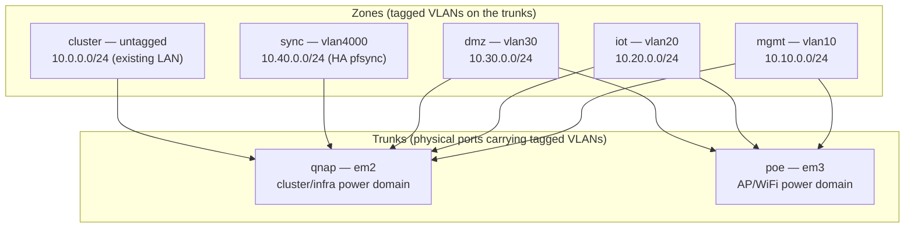

A **trunk** is a physical OPNsense port carrying tagged zone VLANs to one switch
or power domain. A **zone** is a logical network that declares which trunks it
rides; the interfaces role creates the zone's VLAN sub-interface on each listed
trunk parent. This is how one zone can be present on two independent power
domains.

Each zone is a dictionary entry with a consistent shape:

```yaml
# shared/netspec/zones.yml (one zone)
netspec:
  zones:
    mgmt:
      enabled: true
      vlan: 10
      tagged: true
      trunks: [qnap, poe]      # rides both power domains
      role: zone               # zone | cluster | transit | sync
      subnet: "10.10.0.0/24"
      gateway: "10.10.0.1"
      dhcp: true
      dhcp_pool: "10.10.0.100 - 10.10.0.200"
      description: "MGMT - infrastructure management"
```

| Zone field | Meaning |
|---|---|
| `enabled` | include the zone in a run |
| `vlan` | 802.1q tag (0/untagged for the existing flat LAN) |
| `tagged` | carried as a tagged VLAN vs. the native/untagged segment |
| `trunks` | which trunk parents the zone VLAN is created on |
| `role` | `zone` (client subnet), `cluster` (existing LAN), `transit` (routed core), `sync` (HA state) |
| `subnet` / `gateway` | the zone's network and its gateway address |
| `dhcp` / `dhcp_pool` | whether Kea serves the zone, and the lease range |

Top-level netspec fields carry shared values: `cluster_dns` (the resolver to
forward internal queries to), `cluster_domain` (the internal split-horizon zone),
`wan_interface`, `native_blackhole_vlan` (a deny-all native VLAN per trunk), and
`static_hosts` (Unbound reservations).

### The firewall matrix

Inter-zone policy is a table, not procedural rules. Each row is rendered into one
firewall rule, matched on its description (which makes it idempotent — see §15).

```yaml
# shared/netspec/firewall_matrix.yml (excerpts)
firewall_matrix:
  wan_egress:
    - {from: mgmt, to: wan, action: pass, proto: any, desc: "mgmt to internet"}
  isolation:
    - {from: iot, to: mgmt, action: block, proto: any, desc: "iot deny mgmt"}
  allows:
    - {from: mgmt, to: cluster_dns, action: pass, proto: "TCP/UDP", port: 53, desc: "mgmt to dns"}
```

| Group | Intent |
|---|---|
| `wan_egress` | per-zone egress to the internet |
| `isolation` | explicit inter-zone denies (e.g. IoT cannot reach management) |
| `allows` | explicit permits that override isolation |

The matrix is easier to reason about as a reachability graph than as a list of
rows. The diagram below renders the example policy: every zone egresses to the
internet, management reaches every zone, all zones reach the cluster DNS resolver,
and the untrusted zones (IoT, DMZ) are denied lateral access to management and the
cluster.

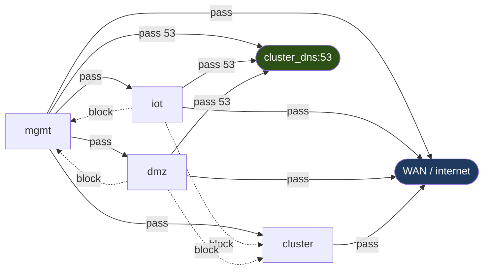

Solid edges are permits; dashed edges are explicit denies. Reading the graph
confirms the design intent: management is the only zone with lateral reach, the
untrusted zones can resolve names and reach the internet but nothing else
internal, and the existing cluster LAN is reachable only from management.

### Per-deployment overrides

A deployment overrides the shared netspec without copying it. `netspec_overrides`
is deep-merged over `shared/netspec/zones.yml`, so a deployment sets only the
leaves that differ:

```yaml
# vars/<deploy>_values.yml
netspec_overrides:
  cluster_dns: "10.0.0.51"
  zones:
    mgmt: {subnet: "10.10.0.0/24", gateway: "10.10.0.1"}
```

> 💡 The shared netspec is the single source of truth. Overrides should contain
> only true deviations; mirroring the defaults into an override silently
> decouples the deployment from future changes to the shared data.

---

## §9 — The roles

The collection contains nine roles. One (`opn_bootstrap_apikey`) runs over SSH and
is invoked by its own playbook; the other eight are API-driven and composed by
`site.yml` in dependency order. Each subsection below gives the role's purpose, its
inputs, its sequence, and the behaviors worth knowing before running it.


### §9.1 opn_connect

**Purpose.** Verify the API answers and the key authenticates before any mutating
role runs. Read-only.

It issues a single list request and asserts the response carries data. A failure
here is the clearest possible signal that credentials or reachability are wrong,
and it stops the run before anything is changed. It is tagged `connect` and
`always`, so it runs at the start of every play.

| Input | Source |
|---|---|
| connection variables | role defaults / environment |

### §9.2 opn_system

**Purpose.** Establish the system baseline: sysctl tunables, and optionally system
identity and WAN.

Tunables are managed as a resource: the role reads the current values, computes
drift, and writes only what changed, producing a truthful changed result.
Identity and WAN are different — they are applied through OPNsense's initialsetup
wizard, which has first-boot semantics, so they are gated behind
`opnsense_apply_identity` (off by default) and are not check-mode dry-runnable.

> ⚠️ Identity/WAN run the wizard. Leave `opnsense_apply_identity: false` until a
> deliberate identity change is intended.

### §9.3 opn_interfaces

**Purpose.** Create the Layer-2/Layer-3 VLAN interfaces: a deny-all native
blackhole VLAN per trunk, and each zone's tagged VLAN on every trunk it rides.

The role builds a zone-to-trunk assignment list from the netspec, creates the
blackhole VLANs, creates the zone VLANs, and applies the interface reload once.
Two optional, off-by-default capabilities live here: preparing trunk ports by
removing them from an existing bridge (a live mutation), and assigning VLAN
devices to interface slots.

> 🔬 **Deeper.** Interface assignment maps a device to an `optN` slot but does not
> set the per-interface IP, which has no REST endpoint in current OPNsense; a
> zone's gateway address is configured outside this automation. Assignment alone
> does not make a zone routable, which is why it is opt-in.

### §9.4 opn_dns

**Purpose.** Configure the Unbound resolver and split-horizon forwarding, and
create static host reservations.

It enables Unbound, forwards the internal zone to the cluster resolver, and
creates static host records for hosts that must resolve by name (Kea does not
register dynamic leases in Unbound, so only static reservations resolve).
Reservations are matched on a composite key (hostname, domain, record type) so
re-runs detect an address change as a change rather than creating a duplicate.

### §9.5 opn_dhcp

**Purpose.** Serve per-zone DHCP from Kea, disabling the conflicting default
Dnsmasq service first.

DHCP is gated by the phase (`zone_dhcp`, off at `coexist`) so it does nothing
until clients are meant to move. When active, it disables Dnsmasq (if
`opnsense_enforce_dnsmasq_disabled`), enables Kea on the DHCP-serving zone
gateways, and creates a subnet per zone with its pool, gateway, and DNS.

### §9.6 opn_firewall

**Purpose.** Render the zone aliases and the inter-zone firewall matrix into
rules, wrapped in a savepoint for safety.

The sequence is deliberate: create network aliases (one per zone, plus a cluster
DNS host alias) and reload them; create a filter savepoint; apply the flattened
matrix rows as rules; reload; verify the API is still reachable; and only then
cancel the savepoint's auto-rollback. If verification fails or the run is
interrupted, the server-side timer reverts the filter section.

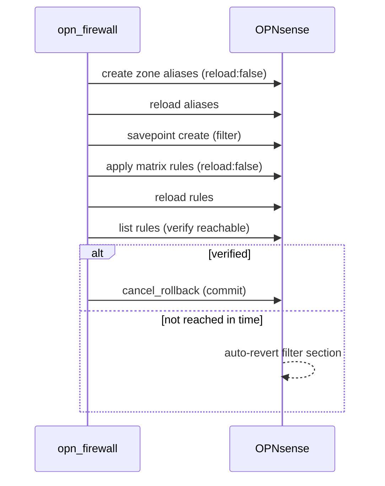

> 🔬 **Deeper — no outbound NAT.** The collection does not create masquerade NAT
> rules. OPNsense's automatic outbound NAT already masquerades internal zones to
> the WAN address, and the upstream `nat_source` module requires a concrete
> translation target (it does not express interface-address masquerade). Manual
> SNAT here would only duplicate the automatic behavior. Explicit `nat_source`
> rules are added only for specific source translations that must override
> automatic NAT. See §16.

### §9.7 opn_ha

**Purpose.** Configure CARP virtual IPs, the HA configuration sync, and trigger a
sync to the peer. Runs only when `opnsense_ha_enabled` is set by the deployment.

It asserts a dedicated SYNC zone exists (pfsync must not ride the data trunk),
creates a CARP VIP per zone gateway with a unique VHID, configures hasync, and on
the master triggers a config sync and HA-service restart on the peer.

The topology is two firewalls sharing a virtual gateway address per zone. Clients
point at the CARP VIP; CARP elects one firewall as master, and pfsync replicates
state over a dedicated SYNC segment so the backup can take over without dropping
connections. Configuration is synced from master to backup over the same segment.

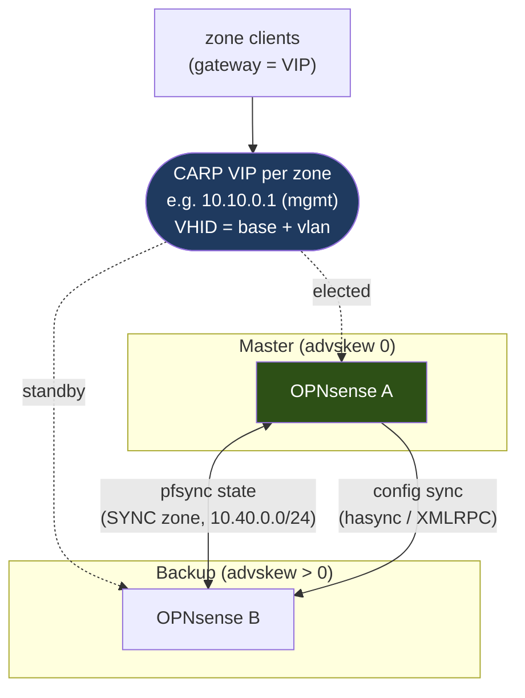

The per-node identity (`opnsense_carp_advskew`, 0 for master, higher for backup)
comes from inventory `host_vars`; everything else — the VIP addresses, VHIDs, and
sync items — is derived from the netspec and the HA variables.

> ⚠️ HA requires a second node and the dedicated SYNC segment. Enable only when the
> peer and sync zone are present.

### §9.8 opn_edge_decommission

**Purpose.** Withdraw edge DHCP/DNS from the legacy cluster segment — the only
role that removes service from the existing LAN. Gated on the `converged` phase.

Before removing anything it queries active Kea leases on the cluster segment and
asserts there are none (`opnsense_require_zero_leases`, on by default). The
withdrawal is therefore backed by measured evidence, not just the phase value: a
device that has not relocated blocks the decommission rather than being stranded.

> ⚠️ **Blast radius.** This role removes service from the live LAN. The evidence
> gate is a safety, not a formality; overriding it is a deliberate operator
> decision.

### §9.9 opn_bootstrap_apikey

**Purpose.** Mint the first API key over SSH as root, so the API-driven roles have
a credential. Invoked by `bootstrap.yml`, not `site.yml`. Full lifecycle in §12.

It renders a mint script to the box, runs it as root (the script uses OPNsense's
own auth model to create and persist a key), removes the script, parses the
result, and writes the key/secret to the deployment's `.env`. It is idempotent and
non-accumulating: without `force` it does nothing when a key exists; with `force`
it mints a new key and deletes the prior keys for the user, so exactly one key
remains.

---

## §10 — Troubleshooting

This section is organized symptom → cause → fix. Each entry is independent; an
operator can scan to the symptom and stop.

### §10.1 `opn_connect` fails with 401 Authentication Failed

| Likely cause | Check | Fix |
|---|---|---|
| Credentials not in the environment | confirm `OPNSENSE_API_KEY`/`SECRET` are exported in the shell that runs ansible | load them (`direnv allow`, or source the env file) |
| Wrong values reaching the playbook | run with `-v` and read which values file the `Load operator values` task loads | point the entrypoint at the right values file (§11) |
| Key not actually on the box | mint or rotate a key (§12) | re-run bootstrap with `force` |
| `lookup('env')` empty because ansible did not inherit the shell env | run the playbook from the shell where the variables are exported, or wrap with `direnv exec <dir>` | use the deploy entrypoint, which loads the env |

> 💡 To prove a credential independent of Ansible, call the API directly:
> `curl -k -u "$OPNSENSE_API_KEY:$OPNSENSE_API_SECRET" https://<fw>/api/core/firmware/status`.
> A 200 means the credential is valid and the problem is variable propagation, not
> the key.

### §10.2 A role fails with "could not resolve the module_defaults group"

The deployment's collections are not installed into a path Ansible searches.
Install them into the playbook-adjacent `collections/` directory:

```bash
ansible-galaxy collection install -r requirements.yml -p collections
```

The deploy entrypoint does this automatically on environment load.

### §10.3 An FQCN role is "not found"

A playbook references `containercraft.opnsense.<role>` but the collection is not
installed where it is searched. The deployment installs into the playbook-adjacent
`collections/` directory, which Ansible always searches regardless of
`ANSIBLE_COLLECTIONS_PATH`. Confirm `collections/ansible_collections/containercraft/opnsense`
exists; re-install if not (§10.2).

### §10.4 Variables resolve empty even though the env is set

`lookup('env', ...)` reads the environment of the ansible process. If the playbook
is launched from a shell that did not export the variables, the lookup returns
empty. Launch from the configured deploy shell, or use `direnv exec <deploy-dir>
ansible-playbook ...` to load the environment first.

### §10.5 The firewall apply reverted itself

`opn_firewall` wraps changes in a savepoint that auto-reverts if the post-apply
verification does not complete in time. If a run is interrupted between apply and
commit, the filter section reverts by design. Re-run the role; the savepoint
mechanism is what prevents a bad rule from locking the operator out.

### §10.6 Python interpreter discovery warning

A warning that the host is using a discovered Python interpreter is informational
and does not affect API-driven runs (the modules run on the controller). It can be
silenced by setting `ansible_python_interpreter` explicitly if desired.

---

## §11 — The iterative rollout runbook

The collection is designed to be applied a little at a time. The pattern is: keep
every optional capability disabled, advance one role (or one toggle) per iteration,
dry-run, read the diff, then apply. This section is the operational procedure.

### Principles

- **One change per iteration.** Run a single tag, or flip a single toggle, then
  re-run that tag.
- **Dry-run before every apply.** `--check --diff` shows exactly what will change.
- **Stay in `coexist` until clients are ready to move.** Advancing the phase is
  itself an iteration.

Every iteration is the same short loop, repeated per concern. The discipline is in
never skipping the dry-run and never advancing two things at once.

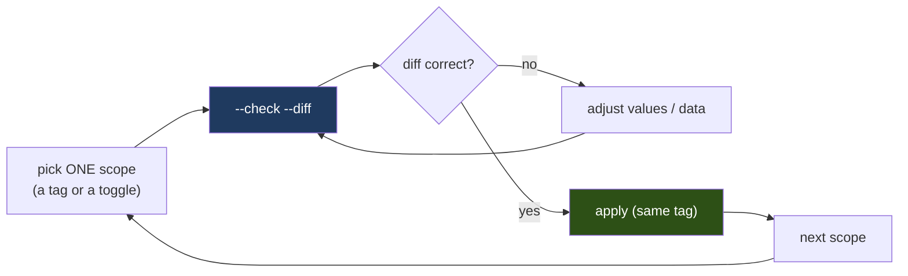

### Procedure

```bash
# 0. Prove connectivity and credentials.
./stargate.yml --tags connect

# 1. System baseline (tunables only; identity stays off).
./stargate.yml --tags system --check --diff
./stargate.yml --tags system

# 2. Interfaces (zone VLANs + blackhole). Review the would-create set first.
./stargate.yml --tags interfaces --check --diff
./stargate.yml --tags interfaces

# 3. DNS.
./stargate.yml --tags dns --check --diff
./stargate.yml --tags dns

# 4. Firewall (aliases + zone rules).
./stargate.yml --tags firewall --check --diff
./stargate.yml --tags firewall

# 5. Advance the phase when clients are ready to move, then enable zone DHCP.
#    Set OPNSENSE_NETWORK_PHASE=migrating (or in the values file), and:
./stargate.yml --tags dhcp --check --diff
./stargate.yml --tags dhcp
```

### The values file as the iteration surface

A deployment's values file disables every optional capability so a full run is
minimal, and documents how to flip each one. Each toggle is a single iteration:
set it true, re-run that role's tag with `--check --diff`, read the diff, apply.

```yaml
# vars/<deploy>_values.yml (capability toggles, all disabled to start)
opnsense_apply_identity: false        # flip for opn_system identity/WAN
opnsense_prepare_trunk_ports: false   # flip for a deliberate trunk cutover
opnsense_assign_interfaces: false     # flip once per-interface IPs are handled
opnsense_enforce_dnsmasq_disabled: false  # flip when bringing up Kea
opnsense_ha_enabled: false            # flip when the HA peer exists
opnsense_require_zero_leases: true    # safety gate — leave on
```

> 💡 The two levers are `--tags` (which role) and the toggles (which capability
> within a role). Combined, they make every step small, reviewable, and
> reversible.

---

## §12 — Bootstrap and the credential lifecycle

An API-configured firewall needs an API key before it can be configured, and
minting that key writes root-owned configuration that the API cannot write. The
bootstrap role resolves this with a single, deliberate SSH-as-root operation.

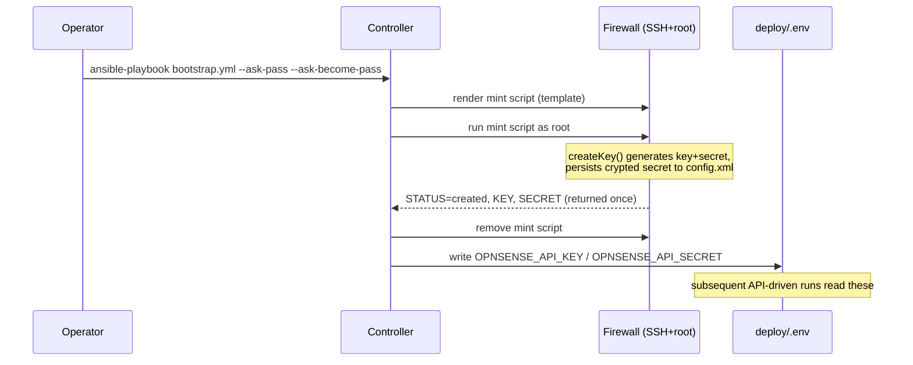

### Lifecycle states

The mint script enforces idempotency and prevents credential accumulation:

| Condition | Behavior | Result |
|---|---|---|
| key exists, no `force` | do nothing | `exists`; `.env` unchanged |
| no key, no `force` | mint one | `created`; `.env` written |
| `force` | mint new, then delete all prior keys for the user | `created`; exactly one key remains |

The same logic as a decision flow — the branch on `force` is what guarantees both
idempotency (a no-op when a usable key exists) and no accumulation (rotation
leaves exactly one key):

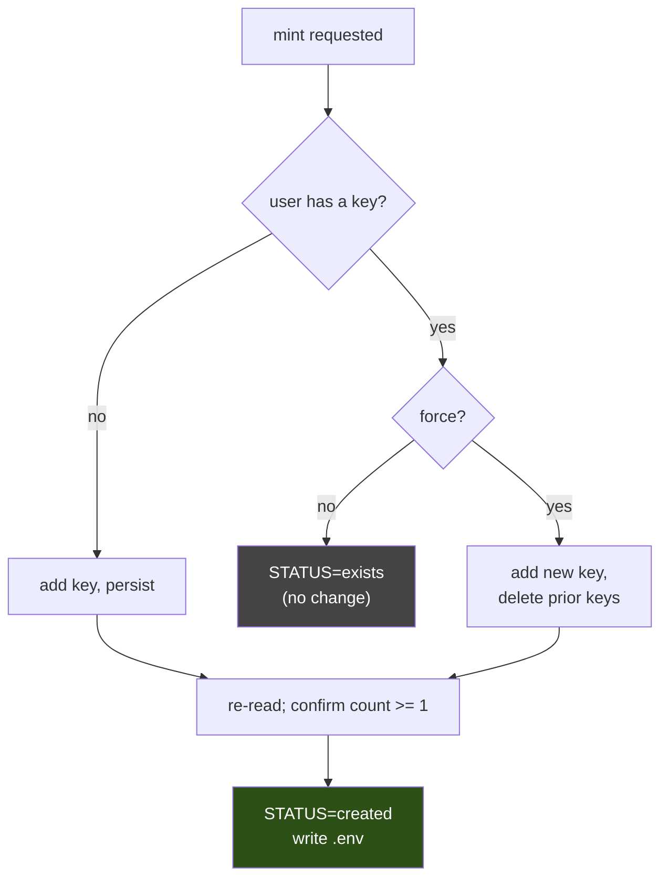

The plaintext secret is returned exactly once at creation and is not retrievable
afterward (OPNsense stores it hashed). If a key exists but its secret was not
captured, the only way to obtain a usable secret is to rotate with `force`. The
old key remains valid until rotation deletes it, so rotation does not cause an
outage.

> 🔬 **Deeper.** The mint script uses OPNsense's own auth model (`getUserByName`,
> the API-key field's `add`/`del`/`all`, and `serializeToConfig` +
> `Config::save()` under a config lock) rather than manipulating `config.xml`
> directly. Counting before and after with the same model call is what makes the
> persistence check correct; an apples-to-oranges count would falsely report
> failure.

> ⚠️ A dedicated, least-privilege service user is recommended as the API-key
> holder, distinct from the SSH/wheel user used to run bootstrap.

---

## §13 — Architecture: a run end to end

This section traces a full `site.yml` run so a reader can see how the pieces
compose. It is read-once material; the per-role detail is in §9.

```mermaid
sequenceDiagram
    participant E as ./stargate.yml
    participant S as site.yml (play)
    participant PRE as pre_tasks
    participant ROLES as roles (FQCN)
    participant FW as OPNsense API

    E->>S: import_playbook, vars: values_file=stargate_values.yml
    S->>PRE: load netspec, phases, matrix, run toggles
    PRE->>PRE: load operator values (this deploy)
    PRE->>PRE: merge netspec_overrides; resolve phase capabilities
    S->>ROLES: opn_connect ... opn_edge_decommission (gated)
    ROLES->>FW: configure objects (reload:false)
    ROLES->>FW: one reload per subsystem
    ROLES->>FW: verify; commit (firewall savepoint)
```

The flow has four stages:

1. **Entry.** The executable entrypoint selects the deployment's values file and
   imports the generic `site.yml`. The site's identity lives only in the
   entrypoint.
2. **Data load.** `pre_tasks` load the netspec, phase map, and firewall matrix
   from `shared/netspec/`, load the deployment's values, deep-merge any netspec
   overrides, and resolve the phase to its capability booleans.
3. **Role composition.** `site.yml` runs the eight API-driven roles in dependency
   order. Each role configures its objects with deferred reloads, then issues a
   single reload, and the firewall role additionally wraps its changes in a
   savepoint.
4. **Convergence.** Re-running produces no changes once the firewall matches the
   declared state. A phase advance changes which roles act, not how they act.

---

## §14 — The collection / deploy split, in depth

§5 introduced the boundary; this section explains why it is drawn exactly where it
is, for readers extending or maintaining the project.

### Why the collection holds only roles

A published collection is consumed by people who do not have this repository's
deploy tree. For their install to work, **every variable a role reads must have a
default inside that role.** If a role depended on a variable defined only in this
repository's `group_vars`, a galaxy install would reference an undefined variable
and fail. Each role therefore carries a complete `defaults/main.yml` with generic,
environment-overridable values — the connection surface, the role's own toggles,
and safe data fallbacks that make the role a no-op rather than an error when run
without site data.

### Why the deploy layer holds identity

The site's identity — its box name, its inventory, its real network data, its
credentials — is not reusable and must not leak into the published artifact. It
lives in `deploy/opnsense/`:

| Deploy artifact | Role |
|---|---|
| `stargate.yml` | executable entrypoint; the only place the box name appears |
| `site.yml` | generic orchestration (no site specifics) |
| `vars/<deploy>_values.yml` | this site's overrides |
| `inventory/` | API target, connection mode |
| `.envrc`, `.env`, `ansible.cfg` | environment, credentials, runtime config |

### How values reach a generic playbook

`site.yml` is generic and must not name a site's values file. The entrypoint sets
the `values_file` variable through the `vars:` it passes to `import_playbook`,
which propagates to the imported play; `site.yml`'s optional `include_vars` then
loads that file. The result: one executable per site, a generic playbook shared by
all sites, and the site name confined to the entrypoint.

```yaml
# deploy/opnsense/stargate.yml
#!/usr/bin/env -S ansible-playbook --inventory=inventory/hosts.yml
- name: "ContainerCraft | stargate | OPNsense edge"
  import_playbook: site.yml
  vars:
    values_file: "{{ playbook_dir }}/vars/stargate_values.yml"
```

> 🔬 **Deeper.** `import_playbook` propagates `vars:` to the imported plays but not
> `vars_files:`. Setting `values_file` via `vars:` is therefore the mechanism that
> lets a generic `site.yml` load a site-specific values file without naming it.

---

## §15 — Idempotency, savepoints, and the safety model

Three mechanisms make the automation safe to run repeatedly against a live device.

### Description-keyed idempotency

Most objects are matched on their description, which carries the managed-by prefix
(`opnsense_managed_tag`). Because the match field is the description, re-running
finds the existing object and updates it in place rather than creating a duplicate.
Changing a managed value is detected as a change; running again with no change is a
no-op. Composite keys are used where a description is insufficient (for example,
Unbound host records match on hostname + domain + record type).

### Savepoint rollback

Firewall filter changes can lock out the operator if a rule is wrong. The firewall
role wraps its changes in a server-side savepoint: it applies the rules, verifies
the API is still reachable, and only then cancels the savepoint's auto-rollback.
If the verification does not complete within the server's timer window, the filter
section reverts automatically. The operator cannot be permanently locked out by a
bad apply.

### Deferred reloads

Bulk object tasks set `reload: false` and each role issues a single reload per
subsystem at its end. This avoids applying a half-built configuration and reduces
churn. It also means a run that is interrupted mid-role generally leaves staged but
un-applied changes rather than a partial live configuration.

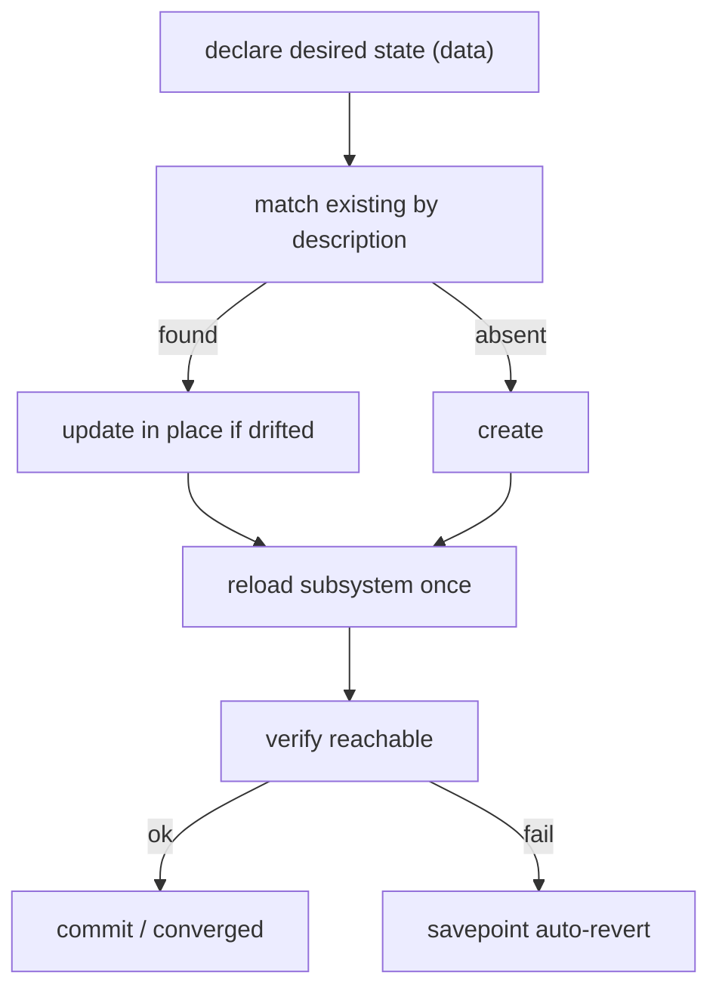

---

## §16 — The oxlorg.opnsense dependency seam

`containercraft.opnsense` orchestrates; the upstream `oxlorg.opnsense` collection
implements the API modules. Keeping this seam clear explains both what the roles
can do and where their boundaries are.

| Concern | Owned by |
|---|---|
| API protocol, request/response, module argument specs | `oxlorg.opnsense` |
| Which objects to create and in what order | `containercraft.opnsense` roles |
| The network's shape (zones, trunks, matrix) | `shared/netspec/` data |
| Credential injection into module calls | `module_defaults` action group |

As layers, the seam looks like this: data and roles are this collection's; the
module that speaks to the firewall is upstream's; and credentials are injected
into upstream's modules by `module_defaults`, except for the `raw`/`uri` tasks
that sit outside the action group and carry credentials explicitly.

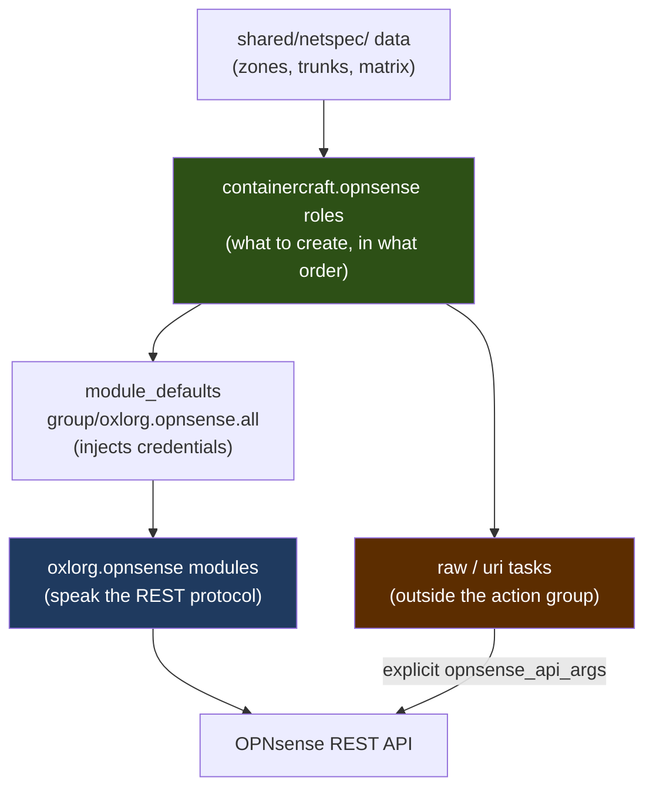

Two consequences follow from this seam:

- **Module capabilities are upstream's to define.** When a module requires a
  particular argument (for example, `nat_source` requires a concrete translation
  target and does not express interface-address masquerade), that is an upstream
  design boundary. The collection works within it rather than around it — which is
  why outbound NAT is left to OPNsense's automatic behavior (§9.6).
- **Credential injection depends on action-group membership.** The
  `module_defaults` group injects the connection arguments only into modules that
  upstream lists in its action groups. The `raw` module and `ansible.builtin.uri`
  are not in that group, so tasks using them pass the connection arguments
  explicitly via `opnsense_api_args`.

> 🔬 **Deeper.** Upstream pins matter. The collection declares an exact dependency
> (`oxlorg.opnsense == <version>`) because module argument specs and action-group
> membership change between versions, and the roles are written against a specific
> contract. Upgrading the dependency is a deliberate, tested change.

---

## §17 — Extending the collection

This section is for contributors adding capability. It assumes familiarity with
§9 and §14.

### Add a zone

A zone is data. Add an entry to `shared/netspec/zones.yml` (or to a deployment's
`netspec_overrides`) with the standard shape (§8). No role changes are required;
the interfaces, DNS, DHCP, and firewall roles all iterate the zone dictionary.

### Add a firewall rule

A rule is a row in `shared/netspec/firewall_matrix.yml`. Add it to the appropriate
group (`wan_egress`, `isolation`, or `allows`) with a unique description. The
firewall role flattens the groups and renders each row.

### Add a phase capability

A capability is a boolean in `shared/netspec/phases.yml` under each phase, and a
`when:` gate in the consuming role. Define the capability for every phase so the
phase map stays total, then gate the role's task on `phase.<capability>`.

### Add a role

A new role joins the collection under `roles/`. To keep the collection
self-contained and publishable:

1. Give the role a complete `defaults/main.yml`: the connection surface, its own
   toggles, and safe data fallbacks (§14).
2. Give it a real `meta/main.yml` with `galaxy_info` (author, license,
   `min_ansible_version`) — not placeholder scaffolding.
3. Prefix role-private variables with the role name
   (`<role>_<var>`) to satisfy the variable-naming rule.
4. Compose it into the deploy's `site.yml` with an FQCN reference
   (`containercraft.opnsense.<role>`) and a tag.

> 🔬 **Deeper.** Match the existing roles' shape exactly: deferred reloads,
> description-keyed idempotency, check-mode guards on tasks that cannot dry-run,
> and the savepoint pattern for anything that can sever connectivity. Consistency
> across roles is what makes the collection learnable.

---

## §18 — Contributing, testing, and publishing

### Local validation

```bash
# Lint the collection at the production profile (galaxy metadata satisfied).
ansible-lint collections/opnsense

# Build the collection artifact.
ansible-galaxy collection build collections/opnsense --output-path build/

# Dry-run the deploy against a reachable box (read-only + would-change).
./stargate.yml --check --diff
```

### Continuous integration

The repository's workflows lint every collection and deploy tree on pull request,
and publish a collection on a version tag. A collection is published by pushing a
tag named `<collection>-v<semver>`; the tag names its collection unambiguously,
the version is stamped into `galaxy.yml` at build time, and the artifact is built
and published. Adding a collection requires no CI change — a new
`collections/<name>/` directory and a matching tag are sufficient.

### What makes a change mergeable

- Lints clean at the production profile.
- Roles remain self-contained (every variable has a role default).
- No site identity leaks into the collection.
- Mutating tasks are check-mode guarded; connectivity-severing tasks are
  savepoint-wrapped.
- The changelog records the change.

> 🔬 **Deeper — versioning.** Collections version independently; there is no
> repository-wide version. The `version` field in `galaxy.yml` is a placeholder
> the publish step overwrites from the git tag, so it is never hand-edited.

---

## §19 — Appendices

### §19.1 Glossary

| Term | Meaning |
|---|---|
| **Zone** | a logical network (usually a VLAN) with a subnet, gateway, and policy |
| **Trunk** | a physical port carrying tagged zone VLANs to a switch/power domain |
| **Blackhole VLAN** | a deny-all native VLAN per trunk; carries no addresses |
| **Phase** | the monotonic migration state (`coexist`…`converged`) |
| **netspec** | the network's shape declared as data in `shared/netspec/` |
| **Firewall matrix** | inter-zone policy declared as a table of rows |
| **Savepoint** | a server-side firewall checkpoint with an auto-revert timer |
| **Managed tag** | the description prefix marking automation-owned objects; also the idempotency key |
| **Action group** | the upstream module set into which `module_defaults` injects credentials |
| **Deploy layer** | the site-specific tree (`deploy/<name>/`) that consumes the collection |
| **Entrypoint** | the executable, shebang-driven playbook that carries a site's identity |
| **CARP / pfsync** | the HA mechanisms: virtual IPs (CARP) and state sync (pfsync) |
| **Kea / Unbound** | the DHCP server and the DNS resolver OPNsense uses |

### §19.2 Environment variable index

| Variable | Consumed by | Default |
|---|---|---|
| `OPNSENSE_FIREWALL` | connection | empty |
| `OPNSENSE_API_KEY` / `OPNSENSE_API_SECRET` | connection | empty |
| `OPNSENSE_API_PORT` | connection | 443 |
| `OPNSENSE_SSL_VERIFY` | connection | false |
| `OPNSENSE_NETWORK_PHASE` | posture | coexist |
| `OPNSENSE_MANAGED_TAG` | marking | ansible-managed |
| `OPNSENSE_APPLY_IDENTITY` | opn_system | false |
| `OPNSENSE_HOSTNAME` / `OPNSENSE_DOMAIN` / `OPNSENSE_TIMEZONE` | opn_system | opnsense / home.arpa / UTC |
| `OPNSENSE_WAN_IPV4_TYPE` | opn_system | dhcp |
| `OPNSENSE_ENFORCE_DNSMASQ_DISABLED` | opn_dhcp | false |
| `OPNSENSE_REQUIRE_ZERO_LEASES` | opn_edge_decommission | true |
| `OPNSENSE_CARP_PASSWORD` / `OPNSENSE_CARP_VHID_BASE` | opn_ha | empty / 1 |
| `OPNSENSE_HASYNC_USERNAME` / `OPNSENSE_HASYNC_PASSWORD` | opn_ha | root / empty |

### §19.3 File index

| Path | Purpose |
|---|---|
| `collections/opnsense/roles/` | the nine roles |
| `collections/opnsense/galaxy.yml` | collection manifest |
| `collections/opnsense/meta/runtime.yml` | required Ansible version |
| `collections/opnsense/changelogs/` | release history |
| `shared/netspec/zones.yml` | zones and trunks |
| `shared/netspec/phases.yml` | phase → capability map |
| `shared/netspec/firewall_matrix.yml` | inter-zone policy |
| `deploy/opnsense/stargate.yml` | executable site entrypoint |
| `deploy/opnsense/site.yml` | generic orchestration |
| `deploy/opnsense/bootstrap.yml` | API-key mint (SSH/root) |
| `deploy/opnsense/vars/*_values.yml` | per-site values |
| `deploy/opnsense/inventory/` | API target and connection mode |

### §19.4 API surface

Each role maps to one or more OPNsense API controllers via the upstream
`oxlorg.opnsense` modules. The authoritative mapping is the role's
`tasks/main.yml` — the module name encodes the controller (e.g.
`oxlorg.opnsense.interface_vlan` → `interfaces/vlan_settings`). Roles that use
`ansible.builtin.uri` or `oxlorg.opnsense.raw` name the controller explicitly in
the task's URL or `controller:` parameter. The bootstrap role is the sole
exception: it operates over SSH, not REST.

### §19.5 Version compatibility

| Component | Requirement |
|---|---|
| `ansible-core` | `>= 2.14` |
| Python (controller) | `>= 3.12` |
| `oxlorg.opnsense` | pinned exact version (see `galaxy.yml` dependencies) |
| OPNsense | a release compatible with the pinned `oxlorg.opnsense` version |

---

*This document is the canonical reference for `containercraft.opnsense`. For the
collection's machine-readable metadata see `galaxy.yml` and `meta/runtime.yml`;
for release history see `changelogs/`.*
